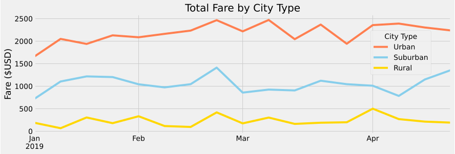
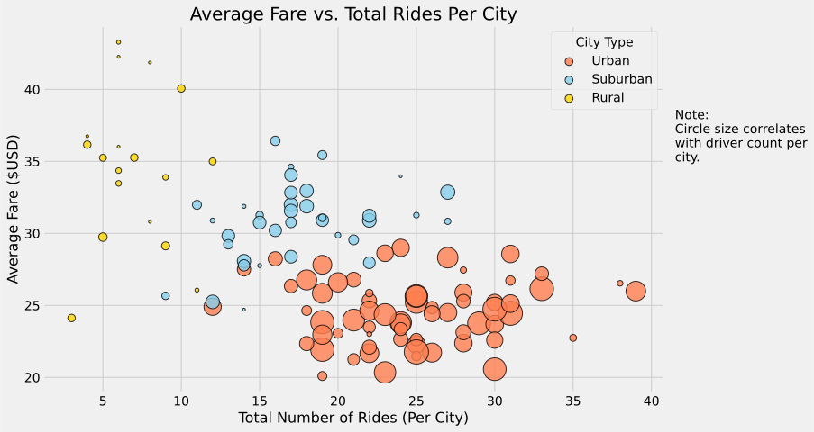

# **Ride-Share Analysis and Visualization**

## **Overview of Project**
The purpose of this project is to analyze ride-share data and use the results to propose recommendations for future business decisions at a hypothetical ride-share company. Fare, ride, and driver data are broken down by Urban, Suburban, and Rural cities in the company's area of operation in order to get a better idea of where the company stands over a four month span in 2019. Another goal of this work is to use the Matplotlib library to create a visual summary of the fares per week for each city type as well as to chart average fare versus total rides with the hope of expanding on the findings of the provided summary table.

The raw data for the cities is found in [city_data.csv](/resources/city_data.csv) and contains the city name, driver count, and city type. The raw ride data is found in [ride_data.csv](/resources/ride_data.csv) and contains the city name, date of the ride, fare, and ride ID. All analysis is contained within the [PyBer_Challenge.ipynb](/PyBer_Challenge.ipynb) script.

## **Analysis and Results**
### **Fare Summary**
To produce the summary DataFrame shown below, the pandas ```DataFrame.groupby()``` function is used to group the data by city type for each of the categories. The results show that Urban cities have the highest volume of rides and fares while also having the largest number of drivers compared to the other city types. Rural cities had the lowest numbers in these three categories. The reverse is true for the average categories: Rural cities have the highest average fare per ride and per driver while Urban cities have the lowest. Additionally, the ratio of total rides to total drivers is as high as 1.60 for Rural cities and as low as 0.68 for Urban cities.

<div align="center">
    
</div>

### **Fares per Week**
To create the following line chart a pivot table was constructed using dates as the index, city type as the columns and fares as the values. The dates were filtered, converted to datetime indices, and resampled by week. The resulting chart shows that Urban cities averaged around $2,100-2,200 on a weekly basis whereas, on the low end, Rural cities averaged around $200-300. However, all three city types showed relative consistency with no real growth or decline in fares per week throughout the timeline.

<div align="center">
    
</div>

### **Average Fares vs. Total Rides**
In the bubble chart shown below, the size of the bubbles is based on the number of drivers in that particular city. The general trend reflects what is seen in the summary table above: Rural cities have fewer rides and higher average fares whereas the Urban cities have more rides but lower average fares with Suburban cities in between the two. Also, it can be noted that Rural cities have higher dispersion in average fares and lower dispersion in the number of rides. Urban cities, however, have lower dispersion in average fares and higher dispersion in the number of rides. Lastly, the Urban cities have the largest differences in driver count as seen by the smallest Urban city bubble compared to the largest Urban city bubble.

<div align="center">
    
</div>

## **Summary**
After reviewing the results, there are a few recommendations that can be made for future directions the company could take.

### *Recommendation 1*
As calculated from the summary table, the ratio of rides per driver in Urban cities seems to be on the low side. The bubble chart also shows that there are some cities with a decent number of drivers and a lower number of rides (large bubble toward the left side of the x-axis). Since rides are relatively spaced out over the four months, the number of rides per week and even per day is relatively small compared to the total number of drivers available at any given time. The company could either reduce the number of drivers or increase advertising to attract more customers in cities with this specific profile.

### *Recommendation 2*
If feasible, the drivers removed in recommendation 1 can be moved to cities that have a higher ride count but a low driver count (small bubbles toward the right of the x-axis per city type). Essentially, move toward a trend of larger bubbles (higher driver counts) on the right side (high ride count) and smaller bubbles on the left side of the bubble chart for each city type. This would improve efficiency based on rides per city (horizontal direction of bubble chart).

### *Recommendation 3*
Related to recommendation 2, improvement to driver distribution can also be made based on the average fare a city produces (vertical direction on the bubble chart). If feasible, drivers can be relocated to cities that have low driver count (smaller bubbles) but high average fares (toward the top of the y-axis per city type). This move would capitalize on cities that earn well on a per ride basis.

Combining recommendations 2 and 3, the company should aim for a general "diagonal" trend on the bubble chart with larger bubbles in the top-right and smaller bubbles in the bottom-left per city type.

A few further notes, if it is infeasible to relocate drivers, advertising campaigns in areas with low driver count that have either high average fare and/or high ride count could work to boost driver counts. Further investigation into fares per city type to see if ride numbers are impacted by the rates being charged may also prove worthwhile.
